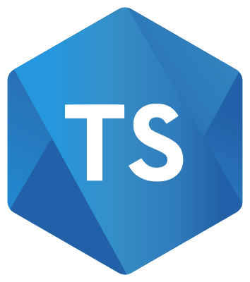
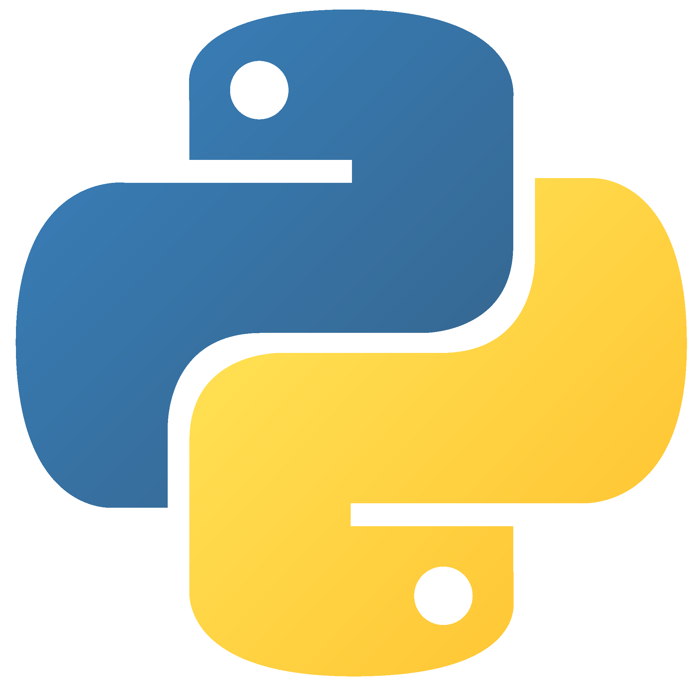
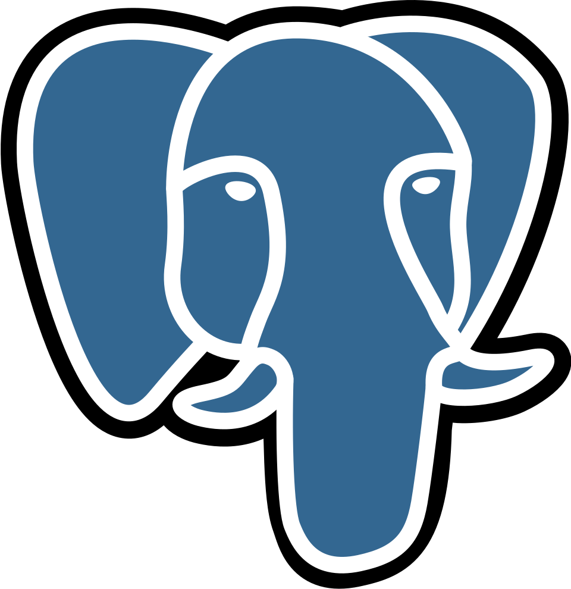
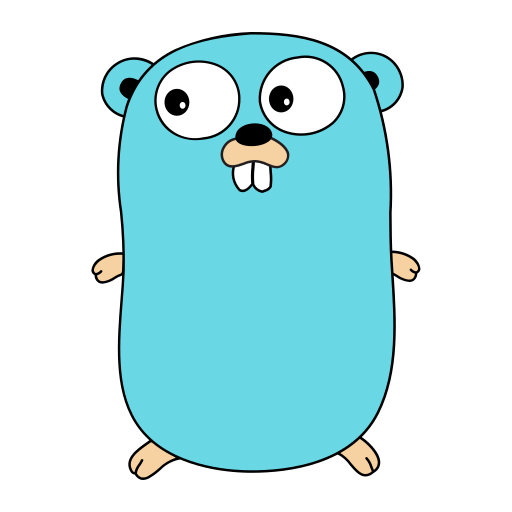
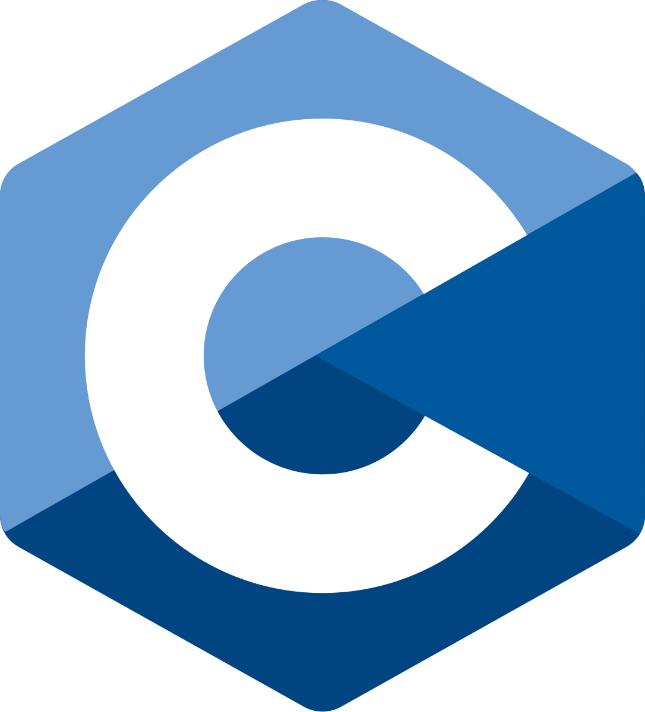
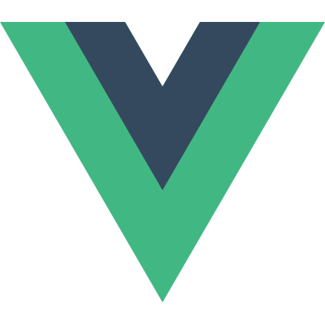
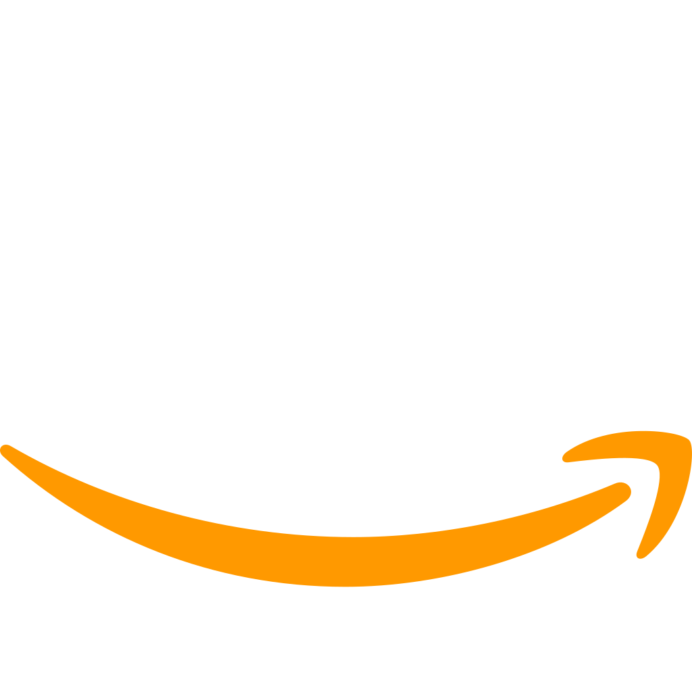
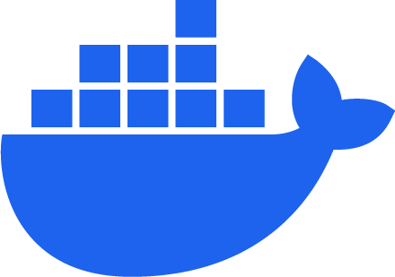

# 👋 Hi, I’m Flávia!

- 💼 Full Stack Developer
- 📖 Studing System Analysis and Development
- 👧🏻 She/her
  
## 💻 Main stack

   
   
   
   
   
   

## 🚀 Other technologies

   
   
   
   
   
   

